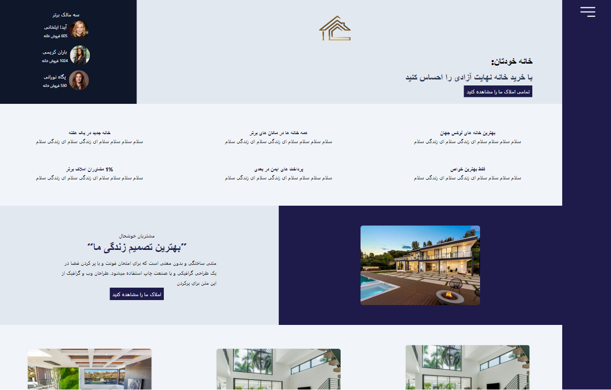
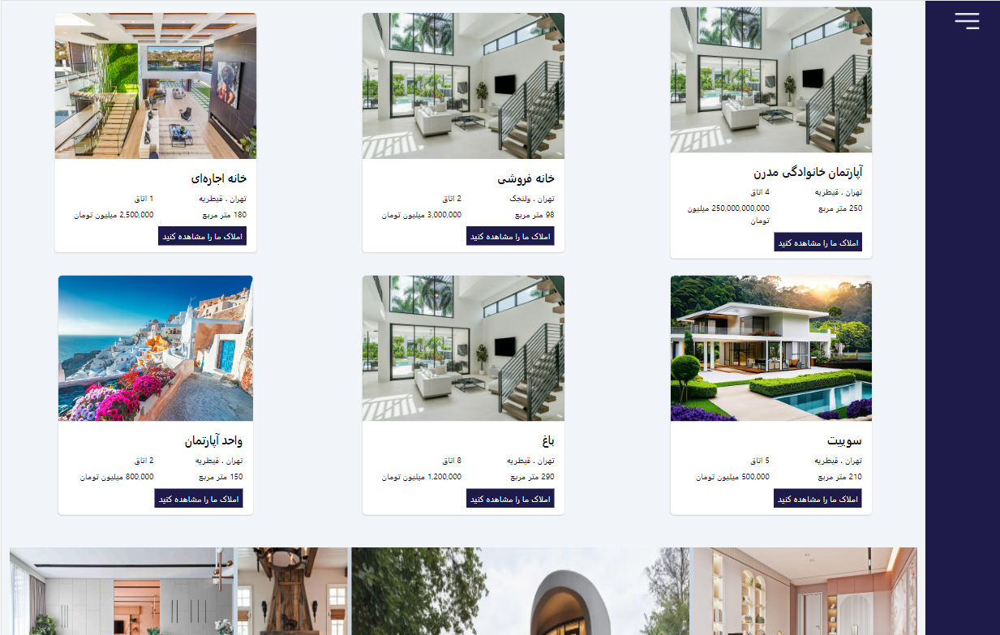
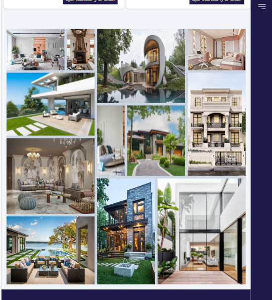
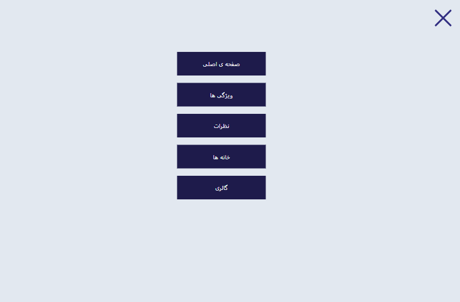
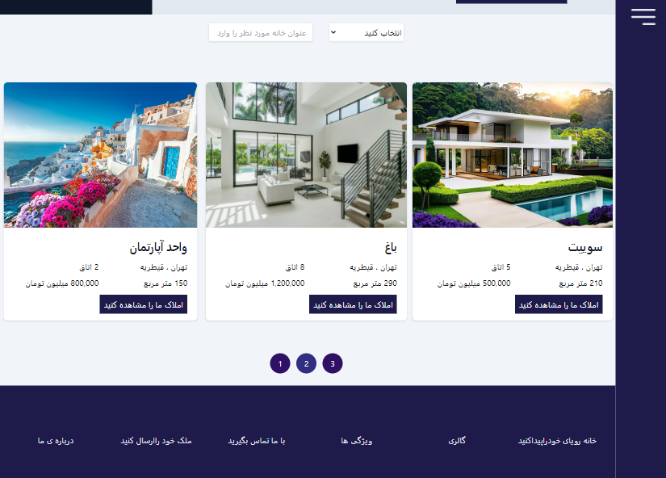
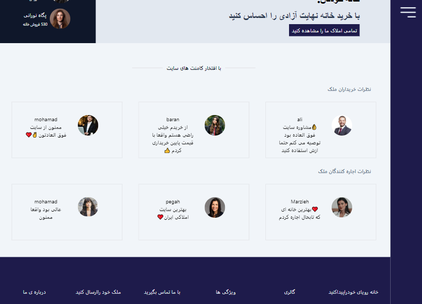
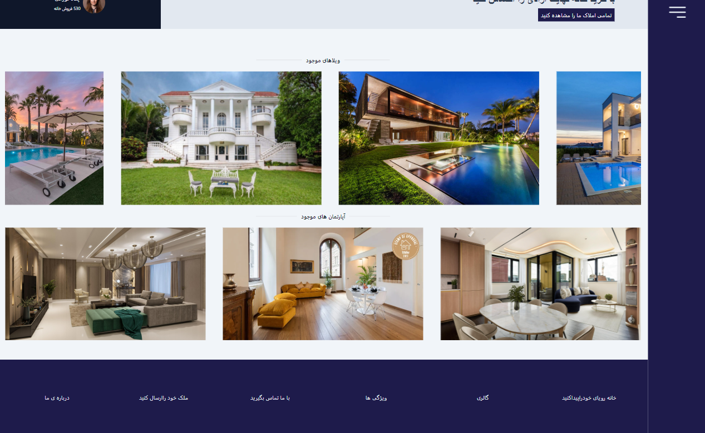
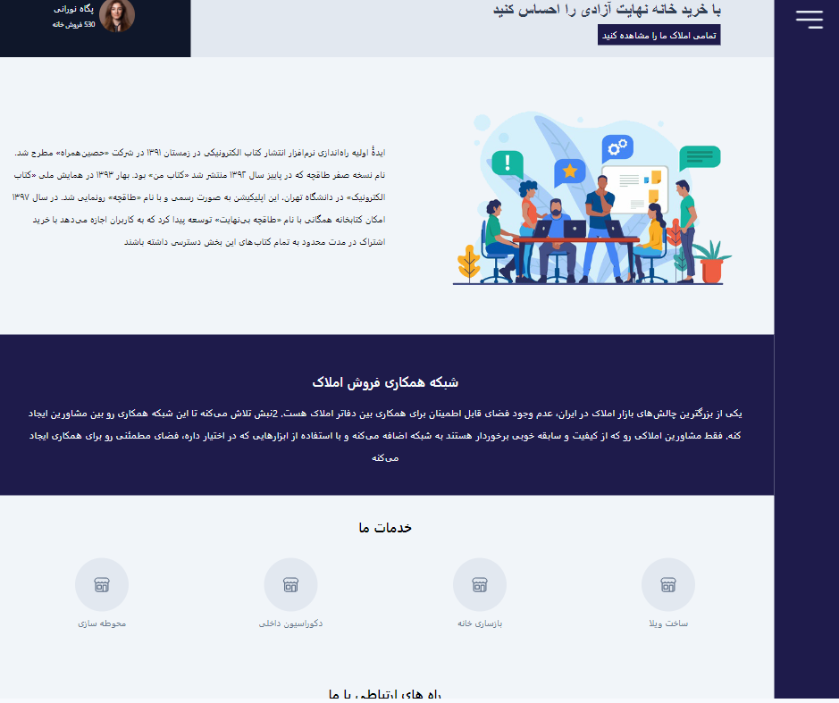
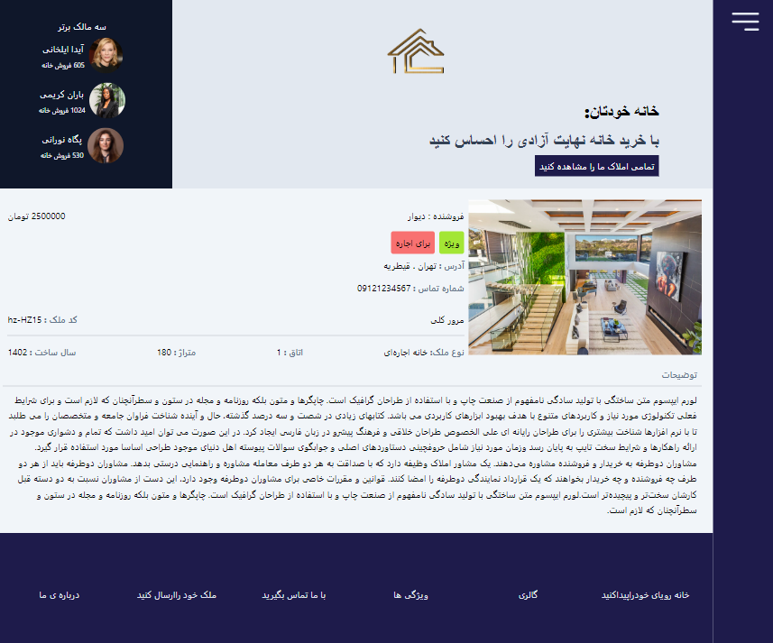

This is a [Next.js](https://nextjs.org/) project bootstrapped with [`create-next-app`](https://github.com/vercel/next.js/tree/canary/packages/create-next-app).

# RealEstate
This is my first next js project

## Technologies Used

   

## Packages Used

- react-toastify
- swiper
- json-server
- react-dom
- react-hook-form
- axios

## Features

You can :
- send youe estate
- order estates
- visit features page
- visit comments page
- visit homes
- visit homes details
- visit connect me page
- visit about us page
- visit gallery

## Screenshots

## Project Status

Project is: _InProcess

## Contact

Created by Marzieh Monshizadeh :)

